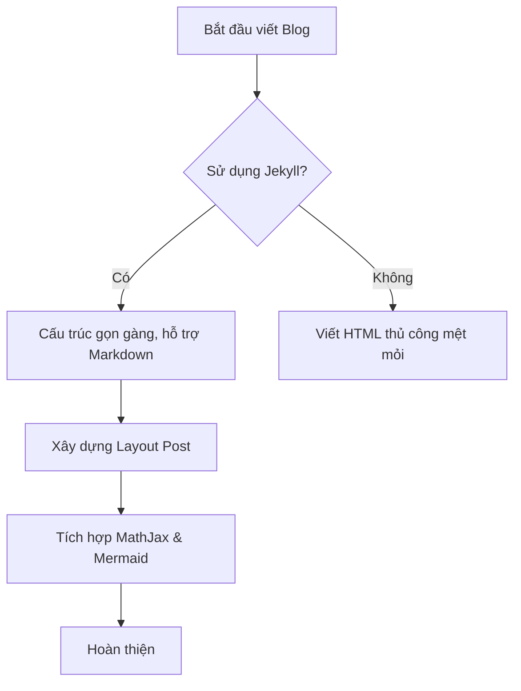

Chào mừng bạn đến với bài viết đầu tiên được tạo bằng **Markdown**! 
Cấu trúc khai báo ở trên cùng file (nằm giữa hai đường `---`) được gọi là **Front-matter**. Nó chứa các thông tin metadata của bài viết như tiêu đề, ngày tháng, ảnh bìa, danh mục,...

Dưới đây là một số ví dụ về việc sử dụng các tính năng mà ta đã tích hợp vào layout `post.html`.

## 1. Viết Công thức Toán học (MathJax)

Bạn có thể viết công thức Toán học trực tiếp trong văn bản bằng cách bọc nó trong dấu `$`. Ví dụ:
Công thức Einstein $E = mc^2$ sẽ được render inline.

Hoặc nếu bạn muốn một khối công thức riêng biệt, hãy bọc bằng `$$`:
$$
\int_0^\infty e^{-x^2} dx = \frac{\sqrt{\pi}}{2}
$$

## 2. Vẽ Biểu đồ với Mermaid.js

Mermaid cho phép bạn tạo các sơ đồ, biểu đồ bằng văn bản thuần. Hãy thử khai báo một khối code markdown với ngôn ngữ là `mermaid`:

## 3. Thêm Bình luận Giscus
Kéo xuống dưới cùng của trang này, bạn sẽ thấy một khoảng trống dành riêng cho **Giscus**. Việc bạn cần làm là truy cập trang chủ của Giscus, cấu hình repository GitHub của mình, lấy đoạn thẻ `<script>` và dán đè vào thẻ `
` trong file `_layouts/post.html`.

Chúc bạn viết blog vui vẻ!
